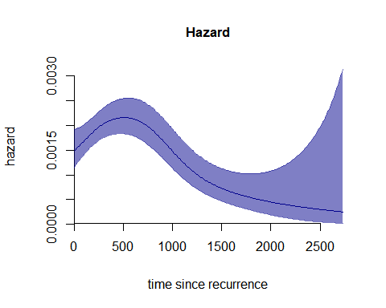

```{r, include = FALSE}
knitr::opts_chunk$set(
  collapse = TRUE,
  comment = "#>",
  eval = FALSE
)
```

```{r setup}
library(TwoTimeScales)
```

Time-to-event data can involve more than one time scale.
In such cases, the hazard of one event can be expressed as a function of two time dimensions.
The two time scales act jointly to determine the hazard levels.

The `TwoTimeScales` package allows the user to estimate and visualize the hazard of one event as a smooth function of two time dimensions (the two time scales).
Additionally, it provides functions to estimate and visualize a smooth hazard with one time scale.

The hazard is estimated as a two-dimensional $P$-splines model for count data with offset.

When working with time-to-event data with multiple time scales, there are three main steps involved:

-   data wrangling and preparation
-   estimation of the smooth hazard model
-   visualization of the results

This document introduces the main tools in the package `TwoTimeScales` and demonstrates how to apply them to smooth hazards with one or two time scales.
This vignette serves as an introduction to the package, and it is therefore a good place to start for new users of the package.
We also provide three additional, more specialized vignettes.

### Data: reccolon2ts

We use data from a clinical trial on colon cancer and the effects of two adjuvant therapies after colon resection [@Laurie:1989; @Moertel:1995].
The original data are included in the R-package `survival` [@R:survival], see `help(survival::colon)`.
Patients were followed, after resection of the colon, from randomization into one of the two treatment groups or the control group (no treatment), to death or end of the study.
The two treatments were either Levamisole, a drug showing immunostimulatory activity, or a combination of Levamisole and Fluorouracil, a moderately toxic chemotherapy agent.

The dataset `colon` contains 929 individuals, and 468 (50.4%) experienced a recurrence of the cancer during follow-up period.
However, seven patients with recurrence left the risk set at the recorded time of recurrence, leaving 461 who were followed up further.
In the dataset `reccolon2ts` we include these 461 individuals.
A description of the data and the variables can be accessed through `help(reccolon2ts)`.

There are two time scales in the `reccolon2ts` data: The time from randomization to death or censoring, measured in days since randomization `reccolon2ts$timedc` and the time since recurrence of the cancer `reccolon2ts$timesr`, also measured in days.
Additionally, we consider another variable, measuring the time from randomization to recurrence `reccolon2ts$timer`.
The latter is not a time scale, but a fixed time covariate which varies among individuals in the data.

In the original dataset, each individual enters the risk set after recurrence at the exact time of the recurrence.
Therefore, individual's observations are not left truncated.
However, to show how the model can easily incorporate left truncation, we introduced some artificial left truncated entry times for 40 individuals in the dataset, `reccolon2ts$entrys` (on the time since recurrence scale), and `reccolon2ts$entryt` (on the time since randomization scale).

```{r data}
str(reccolon2ts)
```
```
'data.frame':	461 obs. of  25 variables:
 $ id      : num  1 3 4 5 6 7 13 14 16 17 ...
 $ study   : num  1 1 1 1 1 1 1 1 1 1 ...
 $ rx      : Factor w/ 3 levels "Obs","Lev","Lev+5FU": 3 1 3 1 3 2 1 2 1 2 ...
 $ sex     : Factor w/ 2 levels "female","male": 2 1 1 2 1 2 2 2 2 2 ...
 $ age     : num  43 71 66 69 57 77 64 68 68 62 ...
 $ obstruct: num  0 0 1 0 0 0 0 1 0 1 ...
 $ perfor  : num  0 0 0 0 0 0 0 0 0 0 ...
 $ adhere  : num  0 1 0 0 0 0 0 0 0 1 ...
 $ nodes   : num  5 7 6 22 9 5 1 3 1 6 ...
 $ status  : num  1 1 1 1 1 1 1 1 0 1 ...
 $ differ  : Factor w/ 3 levels "well","moderate",..: 2 2 2 2 2 2 2 2 2 2 ...
 $ extent  : Factor w/ 4 levels "submucosa","muscle",..: 3 2 3 3 3 3 3 3 3 3 ...
 $ surg    : Factor w/ 2 levels "short","long": 1 1 2 2 1 2 1 1 2 1 ...
 $ node4   : num  1 1 1 1 1 1 0 0 0 1 ...
 $ timedc  : num  1521 963 293 659 1767 ...
 $ etype   : num  2 2 2 2 2 2 2 2 2 2 ...
 $ timer   : num  968 542 245 523 904 ...
 $ entrys  : num  0 0 0 0 0 0 0 0 0 88 ...
 $ timesr  : num  553 421 48 136 863 ...
 $ entryt  : num  968 542 245 523 904 ...
 $ timedc_y: num  4.164 2.637 0.802 1.804 4.838 ...
 $ timesr_y: num  1.514 1.153 0.131 0.372 2.363 ...
 $ entrys_y: num  0 0 0 0 0 ...
 $ entryt_y: num  2.65 1.484 0.671 1.432 2.475 ...
 $ timer_y : num  2.65 1.484 0.671 1.432 2.475 ...
 ```
 

Before we illustrate how to work with the package, a clarification about notation is needed.
In our two time scales model notation, we indicate the two time scales with $t$ and $s$, and the fixed time at entry in the process is indicated with $u$.
Whenever we refer to models with one time scale only, we mostly consider this to be the time scale indicated by $s$ (as opposed to the most common used notation $t$).
Therefore, in all the functions that require the individual times as inputs, the only required inputs will be indicated with $s$ (rather than $t$).

### Step 1: data preparation

Time-to-event data come in the form of a time variable, indicated with $s$, where $s \ge 0$ and a variable which contains the event indicator.
In the simplest time-to-event models, there is only one type of event, so that this event indicator can only assume values 0 and 1.

To apply the $P$-splines model for the hazard we need to bin the individual data into aggregated vectors of exposure times and event indicators.
Therefore, the first step of the analysis, will be data preparation.
This step involves the construction of the bins and the actual binning of the data.
Both steps are implemented and performed by the function `prepare_data()`, which requires as inputs the individual data vectors, and the desired specification for the bins.
This function works in the same way for the case of data with one time scale only, and for data with two time scales.
The only difference is in the inputs required in each of the cases.
We will now illustrate its use in both cases.

#### One time scale only

For data over one time scale, the function requires as minimal inputs only a vector of exit times (`s_out`), a vector of events' indicators (`events`) and the desired bins' size (`ds`).
If the data are left truncated, the entry times can be passed to the argument `s_in`. These can be either extracted from a dataset by using the argument `data` and passing the vector's names in each respective argument, as illustrated below, or by directly passing the vectors.

```{r 1tsprep, cache=T}
dt1ts <- prepare_data(data = reccolon2ts,
                      s_out = "timesr",
                      events = "status",
                      ds = 30)
str(dt1ts)
```
```
List of 2
 $ bins   :List of 3
  ..$ bins_s: num [1:92] 0 30 60 90 120 150 180 210 240 270 ...
  ..$ mids  : num [1:91] 15 45 75 105 135 165 195 225 255 285 ...
  ..$ ns    : int 91
 $ bindata:List of 2
  ..$ r: num [1:91] 13674 13070 12474 12002 11534 ...
  ..$ y: num [1:91] 14 24 16 11 24 22 20 10 24 26 ...
 - attr(*, "class")= chr "data2ts"
 ```

```{r}
print(dt1ts)
```

```
> print(dt1ts)
An object of class 'data2ts'

Data:
List of 2
 $ bins   :List of 3
 $ bindata:List of 2
 - attr(*, "class")= chr "data2ts"
NULL

Range covered by the bins: 
$bins_s
[1]    0 2730


Number of bins: 
$ns
[1] 91


Overview of the binned data:
Total exposure time: 246018
Total number of events: 409
```

The object `dt1ts` is a list with two elements.
The first element is a list of bins (`bins_s`) with their midpoints (`mids`) and the number of bins (`ns`).
The second element of the list is another list with the data binned, a vector of exposures called `r` and a vector of events' counts `y`.
By calling the method `print(dt1ts)`, we obtain additional information about the data, such as the range covered by the bins, the total exposure time and the total number of events.

#### Two time scales

The same function is used to bin the individual data in a two-dimensional grid of rectangles (or squares) over $u$ and $s$, or parallelograms in a Lexis diagram over $t$ and $s$.
The two time scales model is estimated over the half-plane $(u,s)$.
Therefore, we will here discuss only preparation of the data over $u$ and $s$, and defer the discussion of the preparation over the Lexis diagram to the vignette dedicated to the analysis with two time scales.

```{r 2tsprep, cache=TRUE}
dt2ts <- prepare_data(data = reccolon2ts,
                      u = "timer",
                      s_out = "timesr",
                      events = "status",
                      ds = 30)
str(dt2ts)
```

```
> str(dt2ts)
List of 2
 $ bins   :List of 6
  ..$ bins_u: num [1:77] 8 38 68 98 128 158 188 218 248 278 ...
  ..$ midu  : num [1:76] 23 53 83 113 143 173 203 233 263 293 ...
  ..$ nu    : int 76
  ..$ bins_s: num [1:92] 0 30 60 90 120 150 180 210 240 270 ...
  ..$ mids  : num [1:91] 15 45 75 105 135 165 195 225 255 285 ...
  ..$ ns    : int 91
 $ bindata:List of 2
  ..$ R: num [1:76, 1:91] 205 243 540 796 474 812 506 746 657 517 ...
  ..$ Y: num [1:76, 1:91] 1 1 0 1 1 2 1 1 1 2 ...
 - attr(*, "class")= chr "data2ts"
```

```{r}
print(dt2ts)
```
```
> print(dt2ts)
An object of class 'data2ts'

Data:
List of 2
 $ bins   :List of 6
 $ bindata:List of 2
 - attr(*, "class")= chr "data2ts"
NULL

Range covered by the bins: 
$bins_u
[1]    8 2288

$bins_s
[1]    0 2730


Number of bins: 
$nu
[1] 76

$ns
[1] 91


Overview of the binned data:
Total exposure time: 246018
Total number of events: 409
```

We have now included only one additional input `u`, that is the vector with the individuals' time at recurrence of the cancer.
The object `dt2ts` has the same structure as `dt1ts`, but with additional bins over $u$ (`bins_u`, `midu` and `nu`).
The data are now matrices `R` and `Y` of dimension `nu` by `ns`.

#### Including covariates

If we want to estimate a proportional hazard model with covariates a different structure of the data is required (see @Carollo:2024).
The data are augmented by one dimension.
So, for the model with one time scale only, we need to create a matrix of exposure times `R` with dimension `n` (number of individuals in the data) by `ns` (number of bins).
The same goes for the matrix of event counts.
For the model with two time scales, each observation in the sample will be represented by its own matrix of exposure times and matrix of event indicators.
Therefore, the data for the whole sample can be arranged in three-dimensional arrays, with dimensions `nu` by `ns` by `n`.
The function `prepare_data()` does exactly so by specifying the optional input `individual = TRUE`.
It is possible, and recommended, to provide the covariates that one wishes to use in the PH model in the extra argument `covs`.
The function will take care of the preparation of the regression matrix `Z`.
However, if desired, this can also be prepared externally (in which case a warning will be returned).

```{r 2tscov, cache=TRUE}
dt2ts_cov <- prepare_data(data = reccolon2ts,
                          u = "timer",
                          s_in = "entrys",
                          s_out = "timesr",
                          events = "status",
                          ds = 30,
                          individual = TRUE, 
                          covs = c("rx", "node4", "sex"))
str(dt2ts_cov)
```

```
> str(dt2ts_cov)
List of 2
 $ bins   :List of 6
  ..$ bins_u: num [1:77] 8 38 68 98 128 158 188 218 248 278 ...
  ..$ midu  : num [1:76] 23 53 83 113 143 173 203 233 263 293 ...
  ..$ nu    : int 76
  ..$ bins_s: num [1:92] 0 30 60 90 120 150 180 210 240 270 ...
  ..$ mids  : num [1:91] 15 45 75 105 135 165 195 225 255 285 ...
  ..$ ns    : int 91
 $ bindata:List of 3
  ..$ R: num [1:76, 1:91, 1:461] 0 0 0 0 0 0 0 0 0 0 ...
  ..$ Y: num [1:76, 1:91, 1:461] 0 0 0 0 0 0 0 0 0 0 ...
  ..$ Z: num [1:461, 1:6] 0 0 0 0 0 1 0 1 0 1 ...
  .. ..- attr(*, "dimnames")=List of 2
  .. .. ..$ : NULL
  .. .. ..$ : chr [1:6] "rx_Lev" "rx_Lev+5FU" "sex_male" "adhere" ...
 - attr(*, "class")= chr "data2ts"
```

```{r}
print(dt2ts_cov)
```
```
> print(dt2ts_cov)
An object of class 'data2ts'

Data:
List of 2
 $ bins   :List of 6
 $ bindata:List of 3
 - attr(*, "class")= chr "data2ts"
NULL

Range covered by the bins: 
$bins_u
[1]    8 2288

$bins_s
[1]    0 2730


Number of bins: 
$nu
[1] 76

$ns
[1] 91


Overview of the binned data:
Total exposure time: 246018
Total number of events: 409
Covariates:
[1] "rx_Lev"     "rx_Lev+5FU" "sex_male"   "adhere"    
[5] "obstruct"   "node4" 
```

The data are now the three-dimensional arrays, `R` and `Y` and a regression matrix `Z`, where the covariates are transformed in dummy variables (where needed).
The print method returns also the names of the dummy variables, so we can see that from the variable `rx` we obtained the two dummies `rx_Lev` and `rx_Lev+5FU` and from the variable `sex` we obtained now the dummy variable `sex_male` (`Obs` and `female` are reference categories, as well as not having more than four nodes).

### Step 2: Estimation

#### One time scale

To estimate the model we use the function `fit1ts()`.
As input to this function we pass the object returned from `prepare_data`.
Without specifying additional parameters, the function estimates a $P$-splines model, by using numerical optimization of the AIC to find the optimal smoothing parameter.
The $B$-splines basis is built using default options (see `help(fit1ts)` for details).
However, for illustration, we now show how to specify the $B$-splines basis to more closely match the data structure.

```{r 1ts-model, dependson = "1tsprep", cache=TRUE}
m1ts <- fit1ts(data1ts = dt1ts,
               Bbases_spec = list(bdeg = 3,
                                  nseg_s = 20,
                                  min_s = 0,
                                  max_s = 2730))
str(m1ts)
```
```
> str(m1ts)
List of 3
 $ optimal_model :List of 9
  ..$ alpha   : num [1:23, 1] -6.77 -6.58 -6.39 -6.25 -6.19 ...
  ..$ SE_alpha: num [1:23] 0.2276 0.123 0.0763 0.0744 0.0797 ...
  ..$ eta     : num [1:91, 1] -6.56 -6.52 -6.48 -6.44 -6.4 ...
  ..$ H       : num [1:23, 1:23] 0.07508 0.04686 0.02027 0.00324 -0.00366 ...
  ..$ deviance: num 79.4
  ..$ ed      : num 4.25
  ..$ aic     : num 87.9
  ..$ bic     : num 98.6
  ..$ Bbases  :List of 1
  .. ..$ Bs: num [1:91, 1:23] 1.18e-01 5.02e-02 1.52e-02 2.05e-03 2.21e-07 ...
  .. .. ..- attr(*, "x")= num [1:91] 15 45 75 105 135 165 195 225 255 285 ...
  .. .. ..- attr(*, "xl")= num 0
  .. .. ..- attr(*, "xr")= num 2730
  .. .. ..- attr(*, "nseg")= num 20
  .. .. ..- attr(*, "bdeg")= num 3
  .. .. ..- attr(*, "type")= chr "bbase"
 $ optimal_logrho: num 2.02
 $ P_optim       : num [1:23, 1:23] 105 -211 105 0 0 ...
 - attr(*, "class")= chr "haz1ts"
```

Here, we specify a cubic (`bdeg = 3`) $B$-splines basis that covers the range of $s$ from 0 to 2730 days (`min_s` and `max_s` respectively), and is built on 20 segments (`nseg_s = 20`).
The object returned by `fit1ts` is of class `"haz1ts"`.
The first element is a list with the results of the optimal model.
The second element is the optimal smoothing parameter (on the $\log_{10}$-scale) and the last element is the penalty matrix, which incorporates the optimal value of $\varrho$, `P_optim`.

The vignette *Smooth hazards with one time scale* discusses alternative options for estimation, in particular concerning the search for the optimal smoothing parameter.

#### Two time scales

Estimation over the $(u,s)$-plane is performed in the same way.
Here, we illustrate how to use the function `fit2ts()`, and again we will change the default specifications of the marginal $B$-spline bases, but otherwise use default values for the remaining inputs.

```{r 2ts-mod, dependson = "2tsprep", cache=TRUE}
m2ts <- fit2ts(data2ts = dt2ts,
               Bbases_spec = list(bdeg = 3,
                                  nseg_s = 20,
                                  min_s = 0,
                                  max_s = 2730,
                                  nseg_u = 16,
                                  min_u = 0,
                                  max_u = 2300))
summary(m2ts)
```

```
> summary(m2ts)
Number of events =  409 
Model specifications:
  nu =  76 
  ns =  91 
  cu =  19 
  cs =  23 

Optimal smoothing: 
  log10(rho_u) =  2.101313 
  log10(rho_s) =  0.4089259 
  rho_u =  126.2736 
  rho_s =  2.564046 

Model with no covariates

Model diagnostics: 
  AIC =  1249.329 
  BIC =  1313.998 
  ED =  11.02155
```

Whereas the estimates from `fit1ts` are vectors, the ones from `fit2ts` are organized in matrices: The matrix `optimal_model$Alpha`, containing the estimated $B$-splines' coefficients $\alpha_{lm}$, for $l \in 1,\dots,c_u$ (here $c_u = 19$) and $m \in 1,\dots, c_s$ ($c_s = 23$).
And the matrix Eta of dimension $n_u$ by $n_s$ (90 by 91).
Additionally, we have a list with the marginal $B$-splines used for estimation (`optimal_model$Bbases`), a vector of $\log_{10}\varrho_u$ and $\log_{10}\varrho_s$ values (`optimal_logrho`) and finally the penalty matrix (`P_optim`) that incorporates the optimal penalty parameters.

The summary method is implemented for objects of class `haz2ts`, and it returns the model specifications, the optimal smoothing parameters, the effective dimension (ED) and the model fit as measured by the AIC and BIC of the model.

### Step 3: Visualize the results

#### One time scale

Once the model is estimated, we can represent the results with the function `plot()`. The minimal input for `plot()` is the fitted model.
Here, we show how to evaluate the $B$-splines basis on a finer grid of points that are only 10 days apart (as opposite to 30, option that was used for the estimating $B$-splines).
Moreover, we pass as inputs some graphical parameters to obtain a nicer plot.
The result is a plot of the one-dimensional hazard curve over $s$ (time since recurrence), with accompany 95% confidence bands.

```{r 1ts-plot, fig = T, dependson="1ts-mod", fig.width=5, fig.align='center', fig.height=4}
plot(x = m1ts,
     plot_grid = c("smin" = 0, "smax" = 2730, "ds" = 10),
     plot_options= list(
       col = "darkblue",
       main = "Hazard",
       ylab = "hazard",
       xlab = "time since recurrence",
       cex_main = 1))
```


#### Two time scales

There are several options to represent the smooth hazard with two time scales.
Here, we will present only the most simple, yet very informative, way, which is also the default plot returned by the function `plot()`, applied to an object of class `'haz2ts'`.
This is a surface plot of the hazard over the $(u,s)$-plane with white contour lines.
We provide a vignette that only focus on visualization of the hazard with two time scales *Visualize hazards with two time scales*.

```{r 2ts-plot, cache = T, fig = T, dependson="2ts-mod", fig.width=6, fig.height=4.5, fig.align='center'}
plot(x = m2ts,
     plot_grid = list(c("umin" = 0, "umax" = 2300, "du" = 10),
                      c("smin" = 0, "smax" = 2730, "ds" = 10)),
     plot_options= list(
       main = "Bi-dimensional hazard",
       ylab = "time since recurrence",
       xlab = "time since randomization",
       cex_main = 1))
```


## References
