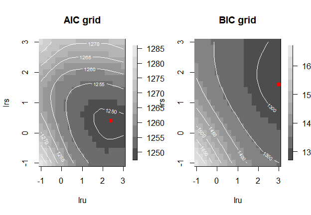
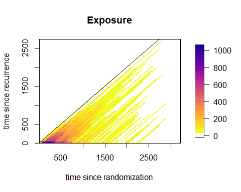

```{r, include = FALSE}
knitr::opts_chunk$set(
  collapse = TRUE,
  comment = "#>",
  eval = FALSE
)
```

```{r}
library(TwoTimeScales)
```

## Introduction

This vignette focuses on the analysis of time-to-event data with two time scales.
We show how to use the functions of the package `TwoTimeScales` with their different options.
In particular we show:

-   how to bin data over the $(u,s)$- or the $(t,s)$-plane
-   how to bin data when covariates are presents
-   how to perform a grid search of the optimal couple of smoothing parameters
-   how to plot the AIC or BIC grid
-   how to perform a numerical optimization of the model
-   how to use the functionalities of the LMMsolver package to find the optimal smoothing parameters
-   how to estimate a model with covariates

This vignette does not deal with visualization of the estimated smooth hazard with two time scales.
Visualization is the topic of the vignette *Visualize hazards with two time scales*.
We assume that the reader of this vignette has some familiarity with the model, and with the basic functions of the package introduced in *Introduction to TwoTimeScales*.
For a full exposition of the model, we refer to @Carollo:2024.

In the following, we once again analyse the dataset `reccolon2ts`, which includes data on patients with recurrence of colon cancer.
The first part of this vignette deals with the model without covariates, and the proportional hazards model for the same analysis follows in the second part.

## Hazard of death by time since randomization and time since recurrence

The two time variables are $t$ = time since randomization and $s$ = time since recurrence.
Additionally, $u$ = time at recurrence, is the fixed time at entry in the risk set recorded as number of days from randomization to recurrence.
The analysis is performed over the $(u,s)$-plane, so we need to bin the data over $u$ and $s$.
We consider bins of width 30 days on both axes, and we obtain 77 bins on the $u$ axis and $91$ bins on the $s$ axis.

```{r}
dt2ts <- prepare_data(data = reccolon2ts,
                      u = "timer",
                      s_out = "timesr",
                      events = "status",
                      ds = 30, du = 30)
```

```         
> print(dt2ts)
An object of class 'data2ts'

Data:
List of 2
 $ bins   :List of 6
 $ bindata:List of 2
 - attr(*, "class")= chr "data2ts"
NULL

Range covered by the bins: 
$bins_u
[1]    8 2288

$bins_s
[1]    0 2730


Number of bins: 
$nu
[1] 76

$ns
[1] 91


Overview of the binned data:
Total exposure time: 246018
Total number of events: 409
```

Here, we do not use the artificially created left truncated entry times on the $s$-axis, therefore the function returns a message informing the user that an entry time of 0 is imputed to all observations.

After having prepared the data we can estimate the model.
In the analysis presented in @Carollo:2024, we build 23 $B$-splines over each of the two dimensions, for a total of 529 $\alpha$ parameters.
The optimal smoothing parameters are chosen by numerical optimization of the AIC of the model as function of the smoothing parameters.
We use cubic $B$-splines bases and a second order penalty.
Here we explicitly specify all these parameters, even though some of them are the default options.

```{r}
mod1 <- fit2ts(data2ts = dt2ts,
               Bbases_spec = list(bdeg = 3,
                                  nseg_s = 20,
                                  min_s = 0,
                                  max_s = 2730,
                                  nseg_u = 20,
                                  min_u = 0,
                                  max_u = 2300),
               lrho = c(2, 0),
               pord = 2,
               optim_method = "ucminf",
               optim_criterion = "aic") 
```

The object returned by `fit2ts()` is of class `'haz2ts'`.
The optimal smoothing parameters are $\varrho_u = 10^{2.4}$ and $\varrho_s=10^{0.3}$, and the effective dimension of the model is 11.1.

```         
> summary(mod1)
Number of events =  409 
Model specifications:
  nu =  76 
  ns =  91 
  cu =  23 
  cs =  23 

Optimal smoothing: 
  log10(rho_u) =  2.402191 
  log10(rho_s) =  0.3104794 
  rho_u =  252.4593 
  rho_s =  2.043993 

Model with no covariates

Model diagnostics: 
  AIC =  1249.297 
  BIC =  1314.651 
  ED =  11.13843
```

We can change the optimization criterion to BIC, and compare the results in terms of smoothing parameters and effective dimensions:

```{r}
mod2 <- fit2ts(data2ts = dt2ts,
               Bbases_spec = list(bdeg = 3,
                                  nseg_s = 20,
                                  min_s = 0,
                                  max_s = 2730,
                                  nseg_u = 20,
                                  min_u = 0,
                                  max_u = 2300),
               lrho = c(2, 0),
               pord = 2,
               optim_method = "ucminf",
               optim_criterion = "bic")

```

```         
> mod2$optimal_logrho
[1] 6.137452 1.550218
> mod2$optimal_model$ed
[1] 5.451275
```

As expected, choosing BIC as optimization criterion results in larger smoothing parameters and a smaller effective dimension, as BIC penalizes model complexity more strongly than AIC.
The following code-chunk shows how to use the grid-search method to select the optimal pair of smoothing parameters and, at the same time, to produce plots of the AIC and BIC values of the grid of $\log_{10}$ values of both smoothing parameters.

```{r}
mod3 <- fit2ts(data2ts = dt2ts,
               Bbases_spec = list(bdeg = 3,
                                  nseg_s = 20,
                                  min_s = 0,
                                  max_s = 2730,
                                  nseg_u = 20,
                                  min_u = 0,
                                  max_u = 2300),
               optim_method = "grid_search",
               optim_criterion = "aic",
               lrho = list(seq(-1, 3, by = .2),
                           seq(-1, 3, by = .2)),
               par_gridsearch = list(
                 plot_aic = TRUE,
                 plot_bic = TRUE,
                 mark_optimal = TRUE,
                 plot_contour = TRUE
               ))
```

{width="660"}

Alternatively, we can ask the function to return the matrices of AIC and/or BIC values as part of the fitted object and then plot them separately (here not shown).

Lastly, we show how to fit the same model by using the package LMMsolver @Boer:2023, that uses the connection between linear mixed models and P-splines, and uses sparse representation to speed-up calculations.
It is possible to fit this model by using the same function `fit2ts()` and specifying the option `optim_method = "LMMsolver"`.
This returns an object of class `haz2tsLMM`, which differ in structure from objects of class `haz2ts`, but has the same methods implemented.

```{r}
mod_LMM <- fit2ts(data2ts = dt2ts,
                  Bbases_spec = list(bdeg = 3,
                                     nseg_s = 20,
                                     min_s = 0,
                                     max_s = 2730,
                                     nseg_u = 20,
                                     min_u = 0,
                                     max_u = 2300),
                  pord = 2,
                  optim_method = "LMMsolver",
                  optim_criterion = "aic")
```

```         
> summary(mod_LMM)
Number of events =  409 
Model specifications:
  nu =  76 
  ns =  91 
  cu =  23 
  cs =  23 

Optimal smoothing: 
  log10(rho_u) =  2.14465 
  log10(rho_s) =  0.5217892 
  rho_u =  139.5243 
  rho_s =  3.324981 

Model with no covariates

Model diagnostics: 
  AIC =  1249.449 
  BIC =  1314.151 
  ED =  11.02726
```

Note: the functions from LMMsolver needed to fit the two time scales hazard model are incorporated in the `TwoTimeScales` package.
Nevertheless, we do recommend interested readers to check out the excellent R-package `LMMsolver` and its accompanying webpage: <https://biometris.github.io/LMMsolver/>

## PH regression for the colon cancer data

We first show how to prepare the data for the analysis with covariates, then we see that there is no need to modify the estimation command, as the function `fit2ts()` automatically recognizes that the data object includes a covariates' matrix and then it correctly estimates a GLAM PH model.

```{r}
dt2ts_cov <- prepare_data(data = reccolon2ts,
                          u = "timer",
                          s_out = "timesr",
                          events = "status",
                          ds = 30,
                          individual = TRUE, 
                          covs = c("rx", "sex", "adhere", "obstruct", "node4"))
```

```         
> print(dt2ts_cov)
An object of class 'data2ts'

Data:
List of 2
 $ bins   :List of 6
 $ bindata:List of 3
 - attr(*, "class")= chr "data2ts"
NULL

Range covered by the bins: 
$bins_u
[1]    8 2288

$bins_s
[1]    0 2730


Number of bins: 
$nu
[1] 76

$ns
[1] 91


Overview of the binned data:
Total exposure time: 246018
Total number of events: 409
Covariates:
[1] "rx_Lev"     "rx_Lev+5FU" "sex_male"   "adhere"    
[5] "obstruct"   "node4"   
```

Then, we pass the object `d2ts_cov` to `fit2ts()` with the same arguments as before.

```{r}
mod_cov <- fit2ts(data2ts = dt2ts_cov,
                  Bbases_spec = list(bdeg = 3,
                                     nseg_s = 20,
                                     min_s = 0,
                                     max_s = 2730,
                                     nseg_u = 20,
                                     min_u = 0,
                                     max_u = 2300),
                  pord = 2,
                  optim_method = "ucminf",
                  optim_criterion = "aic")
```

```         
> summary(mod_cov)
Number of events =  409 
Model specifications:
  nu =  76 
  ns =  91 
  cu =  23 
  cs =  23 

Optimal smoothing: 
  log10(rho_u) =  3.086114 
  log10(rho_s) =  0.2253687 
  rho_u =  1219.309 
  rho_s =  1.68023 

                 beta  se(beta) exp(beta) lower .95 upper.95
rx_Lev     0.06621986 0.1151591  1.068462 0.8272971 1.309626
rx_Lev+5FU 0.38410555 0.1300922  1.468300 1.0939121 1.842689
sex_male   0.25326405 0.1012150  1.288223 1.0326638 1.543783
adhere     0.15249198 0.1306318  1.164733 0.8665169 1.462949
obstruct   0.16664046 0.1218382  1.181329 0.8992247 1.463434
node4      0.39348460 0.1047729  1.482136 1.1777726 1.786500


Model diagnostics: 
  AIC =  3073.101 
  BIC =  3185.81 
  ED =  16.01658
```

### Prepare the data over the Lexis diagram

It is, in principle, possible to prepare the data over the $(t,s)$-plane.
To do so, we pass as arguments to the function `prepare_data()` a vector of entry times and a vector of exit times over the $t$ axis, rather than the vector of entry times $u$.
From the image plot of the exposure times, we can see how the data are only present in the lower half-plane where $t \ge s$.

```{r}
dt2tsLex <- prepare_data(data = reccolon2ts,
                         t_in = "timer",
                         t_out = "timedc",
                         s_out = "timesr",
                         events = "status",
                         ds = 30, dt = 30)
fields::image.plot(dt2tsLex$bins$midt, 
                   dt2tsLex$bins$mids,
                   dt2tsLex$bindata$R,
                   main = "Exposure",
                   xlab = "time since randomization",
                   ylab = "time since recurrence",
                   col = c("white", rev(viridis::plasma(20))))
abline(a=0,b=1)
box()
```



Note: estimation over the $(t,s)$-plane with the same model is theoretically possible, but special care is needed to deal with the larger areas without data support (especially those where $t < s$).
Comparison with the estimation over the $(u,s)$-plane is currently under investigation.
A future version of the package will include options for estimation over the $(t,s)$-plane.
