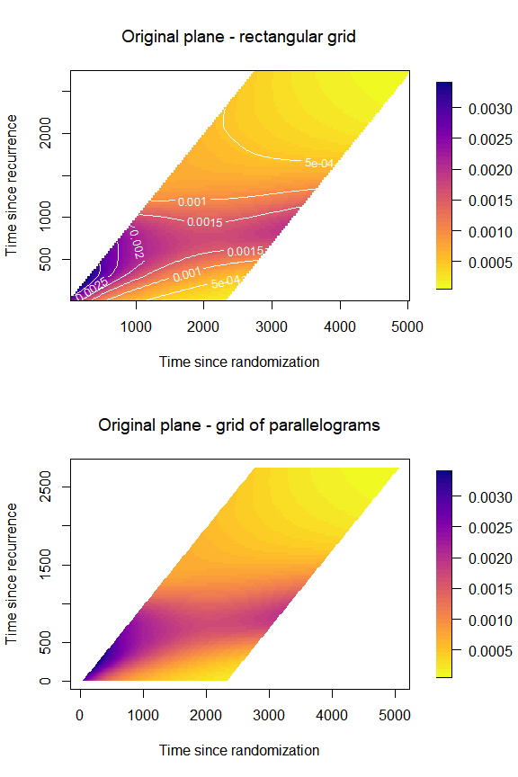

```{r, include = FALSE}
knitr::opts_chunk$set(
  collapse = TRUE,
  comment = "#>",
  eval = FALSE
)
```

```{r}
library(TwoTimeScales)
```

## Introduction

The topic of this vignette is visualization of the hazard of one event over two time scales. We show the complete set of options for the method `plot`, implemented for object of class `'haz2ts'` and `'haz2tsLMM'`. We assume that the reader already knows how to estimate the smooth hazard model with two time scales. Therefore, here we will only discuss the plotting function. For illustration, we will use the same basic model for the colon cancer data presented in the vignette *Smooth hazards with two time scales*.

## The function `plot()`

The method `plot()`, for the class `'haz2ts` offers different possibilities to plot the results of the model with two time scales. The user can choose between plotting the hazard surface `which_plot == "hazard"`, plotting the standard error surface `which_plot == "SE"`, plotting cross-sections (also called "slices") of the surface at specific values of one of the two time dimensions `which_plot == "slices"`, and finally, for a model with covariates' effects, it is possible to plot only the estimated $\beta$ coefficients with their confidence intervals (or on the hazard ratios scale) with `which_plot == "covariates"`.

We will now examine each of these options and their use.

### Baseline hazard and log-hazard

The default plot is the hazard surface over the $(u,s)$-plane, with contour lines in white to mark levels of the hazard. It is obtained by passing the fitted object, obtained from `fit2ts()` (hence of class `'haz2ts'`, or `'haz2tsLMM'`) to the function `plot()`.

```{r}
plot(mod)
```


#### Plot on the $(t,s)$-plane

The same plot can be obtained over the $(t,s)$-plan using a rectangular grid or a grid of parallelograms (in which case it is not possible to plot contour lines). This is done by modifying the arguments `original` and `rectangular_grid` in the list of options for the plotting parameters in `plot_options`. Additionally, we will here customize the title of the plots and the label of the axes.

```{r original, fig = TRUE, dependson="load-mod", fig.width=6, fig.align='center', fig.height=9}
par(mfrow = c(2,1), 
    font.main = 1)
plot(mod,
     plot_options = list(
       rectangular_grid = TRUE,               # for grid of rectangles
       original = TRUE,                       # for plot in (t,s)-plane
       main = "Original plane - rectangular grid",
       xlab = "Time since randomization",
       ylab = "Time since recurrence"
     ))
plot(mod,
     plot_options = list(
       rectangular_grid = F,                # for grid of parallelograms
       original = TRUE,                        # for plot in (t,s)-plane
       main = "Original plane - grid of parallelograms",
       xlab = "Time since randomization",
       ylab = "Time since recurrence"
     ))
par(mfrow = c(1,1))
```



#### Evaluate the $B$-splines on a finer grid

With the default options, the $B$-splines bases used for estimation will be also used to compute the values of the hazard. If the grid of bins used for binning the data, and to evaluate the estimating $B$-splines bases, is already dense (many small bins), the plot of the estimated hazard will appear nicely smooth. However, in some cases, larger bins are used for the original binning of the data and for the estimation of the model. In such cases it may be worthwhile to evaluate the $B$-splines bases on a finer grid of points. The hazard surface will appear much smoother because it will be interpolated over more points. It is possible to change the grid for plotting by passing the specification for a new grid to the argument `plot_grid`. We show how to do so by passing the specification for a grid where the bins are 10 days apart from each other (as opposed to 30). In this case it is a good idea to increase the number of shades in the color legend too.

```{r}
plot(mod,
     plot_grid = list(c(umin = 0, umax = 2300, du = 10),
                      c(smin = 0, smax = 2730, du = 10)),
     plot_options = list(n_shades = 100,
                         main = "Denser plotting grid",
                         xlab = "Time at recurrence",
                         ylab = "Time since recurrence"))
```


#### Plot the log-hazard

We can plot the hazard on the log-scale by changing the argument `loghazard = TRUE` in `plot_options`:

```{r}
par(mfrow = c(2,1), 
    font.main = 1)
plot(mod,
     plot_options = list(
       loghazard = TRUE,
       main = "Log-hazard (u,s)",
       xlab = "Time at recurrence",
       ylab = "Time since recurrence"
     ))
plot(mod,
     plot_options = list(
       original = TRUE,
       loghazard = TRUE,
       main = "Log-hazard (t,s)",
       xlab = "Time since randomization",
       ylab = "Time since recurrence"
     ))
par(mfrow = c(1,1))
```


#### Plot the log10-hazard

Similarly, we can plot the hazard on the log10-scale by changing the argument `log10hazard = TRUE` in `plot_options`:

```{r}
par(mfrow = c(2,1), 
    font.main = 1)
plot(mod,
     plot_options = list(
       log10hazard = TRUE,
       main = "Log10-hazard (u,s)",
       xlab = "Time at recurrence",
       ylab = "Time since recurrence"
     ))
plot(mod,
     plot_options = list(
       original = TRUE,
       log10hazard = TRUE,
       main = "Log10-hazard (t,s)",
       xlab = "Time since randomization",
       ylab = "Time since recurrence"
     ))
par(mfrow = c(1,1))
```


#### Cut extrapolated hazard

@Carollo:2024 discusses the issue of extrapolated hazard beyond the maximum value observed for the time scale $t$. We can limit the plot of the hazard to those areas where it is not extrapolated. We do so by changing the values of `cut_extrapolated = TRUE` and `tmax` in `plot_options`.

```{r}
par(mfrow = c(2,1), 
    font.main = 1)
plot(mod,
     plot_options = list(cut_extrapolated = TRUE,
                         tmax = 3214,
                         main = "Cut extrapolated hazard",
                         xlab = "Time at recurrence",
                         ylab = "Time since recurrence"))

plot(mod,
     plot_options = list(cut_extrapolated = TRUE,
                         tmax = 3214,
                         original = TRUE,
                         main = "Cut extrapolated hazard",
                         xlab = "Time since randomization",
                         ylab = "Time since recurrence"))
```


#### Change color palette and color of the contour lines

Let us try a new color palette and modify the options concerning the contour lines. The palette should be a function of the number of shades, so we need to code one extra line...

```{r}
mycol <- function(nshades){
  colorspace::sequential_hcl(n = nshades, "Blues 3")
}
plot(mod,
     plot_options = list(col_palette = mycol,
                         main = "New colors",
                         xlab = "Time at recurrence",
                         ylab = "Time since recurrence",
                         contour_col = "pink",
                         contour_nlev = 20))
```


### Standard Errors surface

The same options apply for the SE surface, so we will just show how to produce the simplest version of the SE surface plot.

```{r}
plot(mod,
     which_plot = "SE",
     plot_options = list(main = "Standard Errors of the hazard",
                         xlab = "Time at recurrence",
                         ylab = "Time since recurrence"))

plot(mod,
     which_plot = "SE",
     plot_options = list(
       loghazard = TRUE,
       main = "Standard Errors of the log-hazard",
       xlab = "Time at recurrence",
       ylab = "Time since recurrence"))

plot(mod,
     which_plot = "SE",
     plot_options = list(
       log10hazard = TRUE,
       main = "Standard Errors of the log10-hazard",
       xlab = "Time at recurrence",
       ylab = "Time since recurrence"))
```


### Cross-sections of the hazard

Another very informative representation for the 2d hazard consists of plotting 'slices' (or cross-sections) of the two-dimensional hazard as curves over one of the time scales. For example, the 2d hazard surface is plotted as a series of one-dimensional hazard curves over time since recurrence $s$ for selected values of time at recurrence $u$. Note: Adding an automated legend to this kind of plot is still not implemented in the package yet, but we can add one manually.

```{r}
plot(mod,
     which_plot = "slices",
     where_slices = c(30, 60, 90, 180, 365, 1000, 2000),
     direction = "u",
     plot_options = list(main = "Slices of the hazard",
                         xlab = "Time since recurrence",
                         ylab = "Hazard"))
legend("topright",
       legend = c(30, 60, 90, 180, 365, 1000, 2000), 
       lty = 1, 
       col = grDevices::gray.colors(7))
```


It is also possible to plot one-dimensional hazards over time since randomization ($t$) for selected values of time since recurrence ($s$). The interpretation of these one-dimensional hazards is less clear at the individual level, but is meaningful at the population level. To obtain such plot, we specify `direction = "s"`.

```{r slices-s, fig = TRUE, chache = TRUE, dependson="load-mod", fig.width=6, fig.align='center', fig.height=4.5}
plot(mod,
     which_plot = "slices",
     where_slices = c(30, 60, 90, 180, 365, 1000, 2000),
     direction = "s",
     plot_options = list(main = "Slices of the hazard",
                         xlab = "Time since randomization",
                         ylab = "Hazard"))
legend("topright",
       legend = c(30, 60, 90, 180, 365, 1000, 2000), 
       lty = 1, 
       col = grDevices::gray.colors(7))
```


### Survival function
We can represent the survival function as a two-dimensional surface over the $(u,s)$-plane (or the $(t,s)$-plane), or as cross-sectional one-dimensional curves over $s$, for selected values of $u$.

```{r}
mycol2 <- function(nshades){
  colorspace::sequential_hcl(n = nshades, "PurpOr")
}
plot(mod,
     which_plot = "survival",
     plot_options = list(col_palette = mycol2,
                         main = "Survival function",
                         xlab = "Time at recurrence",
                         ylab = "Time since recurrence",
                        contour_nlev = 20))

plot(mod,
     which_plot = "survival",
     where_slices = c(30, 60, 90, 180, 365, 1000, 2000),
     direction = "u",
     plot_options = list(
                         surv_slices = TRUE,
                         main = "Slices of the survival function",
                         xlab = "Time since randomization",
                         ylab = "Survival"))
legend(x = 3000, y = .9,
       xpd = TRUE,
       inset = c(-0.3,0),
       legend = c(30, 60, 90, 180, 365, 1000, 2000), 
       lty = 1, 
       lwd = 2,
       bty = "n",
       title = "Time of\n recurrence",
       col = grDevices::gray.colors(7))

```


### Cumulative hazard 
Similarly, we can plot the cumulative hazard either as a surface or as one-dimensional curves over `s` for selected values of `u`.
```{r}
mycol3 <- function(nshades){
  colorspace::sequential_hcl(n = nshades, "BluGrn")
}
plot(mod,
     which_plot = "cumhaz",
     plot_options = list(col_palette = mycol3,
                         main = "Cumulative hazard",
                         xlab = "Time at recurrence",
                         ylab = "Time since recurrence",
                         contour_nlev = 20))

plot(mod,
     which_plot = "cumhaz",
     where_slices = c(30, 60, 90, 180, 365, 1000, 2000),
     direction = "u",
     plot_options = list(
                         cumhaz_slices = TRUE,
                         main = "Slices of the cumulative hazard",
                         xlab = "Time since randomization",
                         ylab = "Cumulative hazard"))
legend(x = 3000, y = 3.5,
       xpd = TRUE,
       inset = c(-0.3,0),
       legend = c(30, 60, 90, 180, 365, 1000, 2000), 
       lty = 1, 
       lwd = 2,
       bty = "n",
       title = "Time of\n recurrence",
       col = grDevices::gray.colors(7))
```


